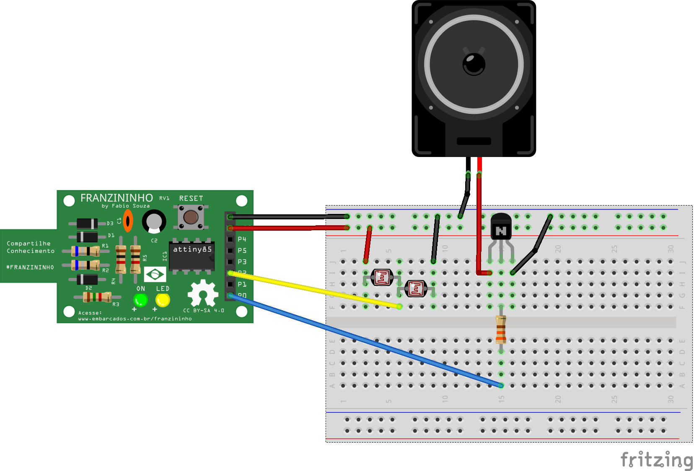

# Theremin

O theremin é um instrumento musical eletrônico controlado sem contato físico. O nome vem do seu inventor, Léon Theremin, que patenteou o dispositivo em 1928.

Nesse tutorial você fará uma versão to theremin usando a Franzininho.


#### Materiais necessários

* Franzininho
* 2 LDR
* BC548
* Resistor 330 R
* Alto falante 8 ohm

#### Circuito



  


#### Código

O código a seguir ler o valor da entrada analógica e atua na saída do speaker


```c
/*
 * Theremim Franzininho
 * Autor: Fábio Souza
 * Data: 10/09/2018
 */
int speaker = 0; // pino de saída do falante
int sensor = 1;
void setup()
{
 pinMode(speaker, OUTPUT);
}
// Theremin
void loop()
{
 digitalWrite(speaker, HIGH);
 delayMicroseconds(analogRead(sensor)<<2);
 digitalWrite(speaker, LOW);
 delayMicroseconds(analogRead(sensor)<<2);
}
```



### Vídeo




