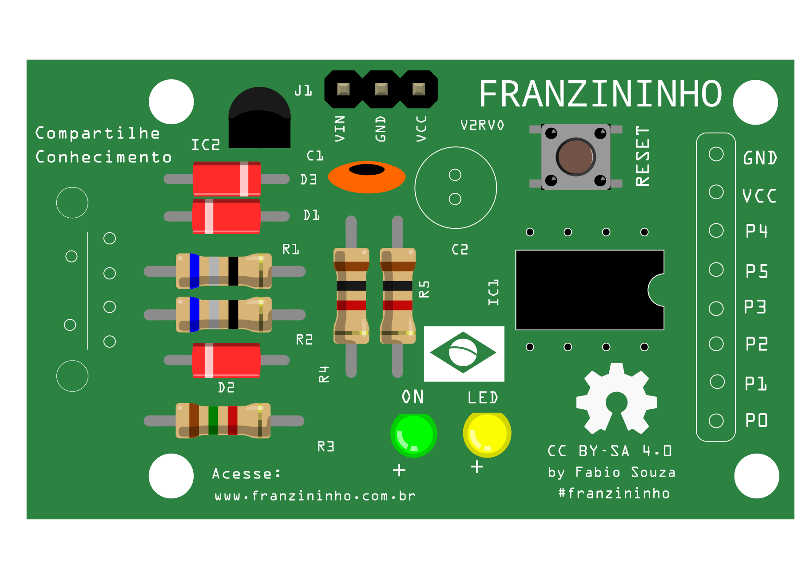

# Montando a Versão V2RV0

Antes de tudo você deve preparar o ambiente, separando as ferramentas necessárias para a soldagem, vamos precisar de:

* Ferro de solda
* Rolo de estanho
* Alicate de corte etc.
* Óculos de proteção

Você também deve separar os componentes para facilitar na hora de soldar. Você encontra os componentes na lista de materiais. Tudo organizado, então vamos lá?!

### **Montando a Versão V2RV0** 

De início você terá uma placa sem componentes, conforme a imagem abaixo:

Você deve sempre começar pelos componentes baixos, você pode seguir conforme o modelo abaixo:

**Diodo 1N1448**

O primeiro componente a ser colocado é o Diodo 1N4148 no D3, cuidando com a polaridade dele: a faixa preta do diodo deve ser colocada conforme o desenho da placa.

 **Diodos Zener \(3V6\)**

Temos dois diodos zener que deverão ser colocados nas referências D1 e D2. Lembre-se da polaridade deles, coloque do lado certo!

**Resistores 68R**

Nas referências R1 e R2 você irá colocar o resistor 68R que é representado pelas cores \(Azul,cinza,preto,dourado\)

**Resistor 1K5**

Em R3 deve-se colocar o resistor 1k5 que é representado nas cores \(Marrom, verde,vermelho,dourado\)

 **Resistores 1K**

Resistores de 1K que são representados nas cores \(Marrom, preto, vermelho,dourado\) devem ser colocados em R4 e R5.

**Soquete 8 pinos**

O soquete deve ser colocado no IC1 que traz a facilidade do encaixe do Attiny85.

**Chave táctil**

A chave você consegue colocar apenas uma posição, então é só encaixá-la.

**Capacitor Cerâmico**

No C1 você irá colocar o capacitor cerâmico.

**LED Verde**

O LED verde deve ser colocado no ON.

**LED Amarelo**

O LED amarelo deve ser colocado no LED.

**Regulador de tensão**

No IC2 você deve colocar o regulador. Ele tem 3 terminais e deve ser colocado conforme o desenho na placa.

**Barra de 3 pinos**

Em J1, onde está indicado com VIN, GND, VCC, você irá colocar a barra com três pinos.

**Barra de 8 pinos**

Deverá ser colocada onde estão indicados \(GND, VCC, P6, ..., P1,P0\)

**Capacitor eletrolítico**

Agora vamos colocar o capacitor eletrolítico em C2.

**Conector USB**

Quase lá! Iremos agora colocar o conector USB, conforme o encaixe dele.

**Attiny85**

Por último iremos colocar o microcontrolador ATtiny85 no soquete de 8 pinos que colocamos antes.

Pronto!

Sua Franzininho versão 2 está montada, agora é só programar e criar vários projetos.

