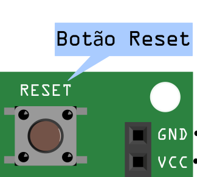

# Upload do Sketch

## Upload do sketch

Dependendo do bootloader gravado na placa, há duas formas de fazer upload do sketch:

## Arduino Gemma

Para fazer o upload para a Franzininho é necessário seguir os passos abaixo:

1 - Certifique que a placa está conectada ao computador:


2 - Pressione o botão de Reset:



3 - Imediatamente em seguida clique no botão de upload na IDE:


4 - É iniciada a programação:


5 - Após alguns instantes a sua Franzininho estará programada:


Maravilha, sua Franzininho foi programada. Repita o procedimento acima, toda vez que for fazer o upload de código para sua placa.

## Micronucleus - Disgispark

O processo de gravação para o Micronucleus é um pouco diferente.

1 - Certifique que a placa está conectada ao computador:


2 - Clique no botão de upload na IDE:


3 - Após a compilação será exibidada seguinte mensagem:


Você tem até 60 segundos para inserir a placa na USB do computador.

4 - Plugue a Franzininho na porta USB do seu computador

Após plugar a placa será iniciado o upload do código:


Pronto, a sua Franzininho está programada. Repita o procedimento acima toda vez que for fazer upload de código para a placa. 


### Solução de problemas:

#### \(Micronucleus\) Erro ao fazer upload \(Contribuição de [caioau](https://github.com/caioau) \)

Caso o erro abaixo \(ou parecido\) apareça:

```text
Warning: device with unknown new version of Micronucleus detected.
This tool doesn't know how to upload to this new device. Updates may be available.
Device reports version as: 2.4
```

Significa que a ferramenta que faz o upload do computador para a placa com o Micronucleus está desatualizada.

Caso não tenha instalado gcc e make, instale-os:

> sudo apt install build-essential git

Clone o repositório do micronucleus:

> git clone git@github.com:micronucleus/micronucleus.git

Compile e substitua o binário antigo pelo atualizado:

```text
cd micronucleus/commandline/
make
cp micronucleus /home/<SEU_USUARIO>/.arduino15/packages/digistump/tools/micronucleus/2.0a4/micronucleus
```

Tudo pronto! Deve estar funcionando agora. Tente compilar e fazer o upload novamente.

Caso retorne o seguinte erro após o make:

```text
Building library: micronucleus_lib...
gcc   -Ilibrary -O -g -D LINUX -c library/micronucleus_lib.c
In file included from library/micronucleus_lib.c:30:0:
library/micronucleus_lib.h:35:80: fatal error: usb.h: No such file or directory
   #include <usb.h>        // this is libusb, see http://libusb.sourceforge.net/
                                                                                ^
compilation terminated.
Makefile:49: recipe for target 'micronucleus_lib' failed
make: *** [micronucleus_lib] Error 1
--- End code ---
```

Instale:

```text
sudo apt-get install libusb-dev
```

E compile novamente. 

